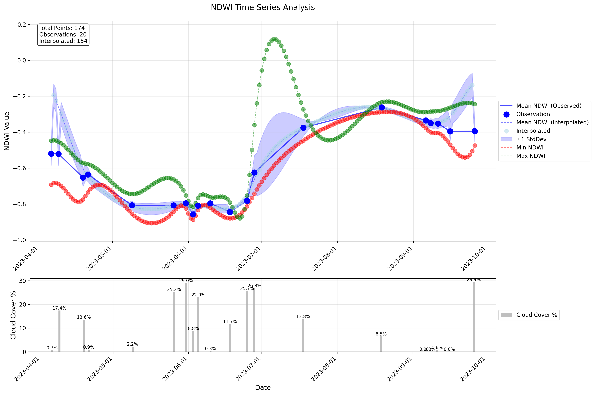

# Satellite-Based Indices Calculator Suite

A comprehensive suite of tools for calculating various satellite-based indices using Google Earth Engine and Sentinel-2 satellite imagery. This suite includes calculators for NDWI, BSI, SAVI, NDRE, and MCARI indices.

## Developer
**Muhammad Arslan**

## Overview

This suite provides tools for analyzing different aspects of vegetation, soil, and water characteristics using satellite imagery. Each calculator is specialized for specific environmental monitoring purposes:

| Index | Full Name | Primary Purpose |
|-------|-----------|----------------|
| NDWI | Normalized Difference Water Index | Water content in vegetation and water bodies |
| BSI | Bare Soil Index | Detection of bare soil and built-up areas |
| SAVI | Soil Adjusted Vegetation Index | Vegetation health with soil brightness correction |
| NDRE | Normalized Difference Red Edge | Crop health and nitrogen content monitoring |
| MCARI | Modified Chlorophyll Absorption Ratio Index | Chlorophyll concentration estimation |

## Features Common to All Calculators

- Processing of Sentinel-2 satellite imagery
- Cloud cover handling and data gap filling
- Time series visualization
- Quality control and validation
- CSV output with detailed metadata
- Google Earth Engine integration
- Sample field data for testing

## Sentinel-2 Data Specifications

### Temporal Resolution
- 5-day revisit time at the equator (Sentinel-2A & 2B combined)
- Individual satellite revisit: 10 days
- Data availability: From June 2015 (2A) and March 2017 (2B) to present

### Spatial Resolution
- 10m: RGB and NIR bands (Bands 2, 3, 4, and 8)
- 20m: Red edge and SWIR bands (Bands 5, 6, 7, 8A, 11, and 12)
- 60m: Atmospheric bands (Bands 1, 9, and 10)

### Coverage
- Global coverage between latitudes 84°N and 56°S
- 290km swath width
- 100x100 km tile size

## Index Formulas and Interpretation

### 1. NDWI (Normalized Difference Water Index)
```
NDWI = (GREEN - NIR) / (GREEN + NIR)
```
Where:
- GREEN = Green reflectance (Sentinel-2 Band 3: 560 nm)
- NIR = Near-infrared reflectance (Sentinel-2 Band 8: 842 nm)

Value Ranges:
- > 0.3: Open water or very high moisture
- 0.0 to 0.3: High vegetation water content
- -0.1 to 0.0: Moderate vegetation water content
- -0.3 to -0.1: Low vegetation water content
- < -0.3: Very dry vegetation or bare soil

### 2. BSI (Bare Soil Index)
```
BSI = ((SWIR + RED) - (NIR + BLUE)) / ((SWIR + RED) + (NIR + BLUE))
```
Where:
- SWIR = Short-wave Infrared reflectance (Sentinel-2 Band 11: 1610 nm)
- RED = Red reflectance (Sentinel-2 Band 4: 665 nm)
- NIR = Near-infrared reflectance (Sentinel-2 Band 8: 842 nm)
- BLUE = Blue reflectance (Sentinel-2 Band 2: 490 nm)

Value Ranges:
- > 0.3: High bare soil exposure/built-up areas
- 0.0 to 0.3: Moderate soil exposure
- -0.3 to 0.0: Low soil exposure
- < -0.3: Dense vegetation or water bodies

### 3. SAVI (Soil Adjusted Vegetation Index)
```
SAVI = ((NIR - RED) * (1 + L)) / (NIR + RED + L)
```
Where:
- NIR = Near-infrared reflectance (Sentinel-2 Band 8: 842 nm)
- RED = Red reflectance (Sentinel-2 Band 4: 665 nm)
- L = Soil brightness correction factor (typically 0.5)

Value Ranges:
- > 0.5: Dense, healthy vegetation
- 0.2 - 0.5: Moderate vegetation cover
- 0.1 - 0.2: Sparse vegetation
- < 0.1: Very sparse vegetation or bare soil
- < 0: Water or non-vegetated surfaces

### 4. NDRE (Normalized Difference Red Edge)
```
NDRE = (NIR - REDEDGE) / (NIR + REDEDGE)
```
Where:
- NIR = Near-infrared reflectance (Sentinel-2 Band 8: 842 nm)
- REDEDGE = Red-edge reflectance (Sentinel-2 Band 5: 705 nm)

Value Ranges:
- > 0.4: Very healthy vegetation with high nitrogen
- 0.3 - 0.4: Good vegetation health
- 0.2 - 0.3: Moderate vegetation health
- 0.1 - 0.2: Poor health or nitrogen stress
- < 0.1: Severe stress
- < 0: Water, shadows, or non-vegetation

### 5. MCARI (Modified Chlorophyll Absorption Ratio Index)
```
MCARI = [(NIR - RED) - 0.2(RED - GREEN)] * (NIR/RED)
```
Where:
- NIR = Near-infrared reflectance (Sentinel-2 Band 8: 842 nm)
- RED = Red reflectance (Sentinel-2 Band 4: 665 nm)
- GREEN = Green reflectance (Sentinel-2 Band 3: 560 nm)

Value Ranges:
- > 0.12: Very high chlorophyll content
- 0.08-0.12: Good chlorophyll content
- 0.04-0.08: Moderate chlorophyll content
- 0.02-0.04: Low chlorophyll content
- < 0.02: Very low chlorophyll or non-vegetated

## Detailed Index Equations and References

### 1. NDWI (Normalized Difference Water Index)
```
NDWI = (GREEN - NIR) / (GREEN + NIR)
```
Where:
- GREEN = Green reflectance (Sentinel-2 Band 3: 560 nm)
- NIR = Near-infrared reflectance (Sentinel-2 Band 8: 842 nm)

**References:**
- Original NDWI formulation:
  - McFeeters, S.K. (1996). The use of the Normalized Difference Water Index (NDWI) in the delineation of open water features. International Journal of Remote Sensing, 17(7), 1425-1432.
- Sentinel-2 band adaptation and validation:
  - Du, Y., Zhang, Y., Ling, F., Wang, Q., Li, W., & Li, X. (2016). Water bodies' mapping from Sentinel-2 imagery with modified normalized difference water index at 10-m spatial resolution produced by sharpening the SWIR band. Remote Sensing, 8(4), 354.

### 2. BSI (Bare Soil Index)
```
BSI = ((SWIR + RED) - (NIR + BLUE)) / ((SWIR + RED) + (NIR + BLUE))
```
Where:
- SWIR = Short-wave Infrared reflectance (Sentinel-2 Band 11: 1610 nm)
- RED = Red reflectance (Sentinel-2 Band 4: 665 nm)
- NIR = Near-infrared reflectance (Sentinel-2 Band 8: 842 nm)
- BLUE = Blue reflectance (Sentinel-2 Band 2: 490 nm)

**References:**
- Original BSI formulation and validation:
  - Rikimaru, A., Roy, P. S., & Miyatake, S. (2002). Tropical forest cover density mapping. Tropical Ecology, 43(1), 39-47.
- Sentinel-2 adaptation and validation:
  - Diek, S., Fornallaz, F., Schaepman, M., & De Jong, R. (2017). Barest Pixel Composite for agricultural areas using Landsat time series. Remote Sensing, 9(12), 1245.

### 3. SAVI (Soil Adjusted Vegetation Index)
```
SAVI = ((NIR - RED) * (1 + L)) / (NIR + RED + L)
```
Where:
- NIR = Near-infrared reflectance (Sentinel-2 Band 8: 842 nm)
- RED = Red reflectance (Sentinel-2 Band 4: 665 nm)
- L = Soil brightness correction factor (typically 0.5)

**References:**
- Original SAVI formulation:
  - Huete, A.R. (1988). A soil-adjusted vegetation index (SAVI). Remote Sensing of Environment, 25(3), 295-309.
- Sentinel-2 validation and application:
  - Delegido, J., Verrelst, J., Alonso, L., & Moreno, J. (2011). Evaluation of Sentinel-2 red-edge bands for empirical estimation of green LAI and chlorophyll content. Sensors, 11(7), 7063-7081.

### 4. NDRE (Normalized Difference Red Edge)
```
NDRE = (NIR - REDEDGE) / (NIR + REDEDGE)
```
Where:
- NIR = Near-infrared reflectance (Sentinel-2 Band 8: 842 nm)
- REDEDGE = Red-edge reflectance (Sentinel-2 Band 5: 705 nm)

**References:**
- Original NDRE development and validation:
  - Gitelson, A., & Merzlyak, M. N. (1994). Spectral reflectance changes associated with autumn senescence of Aesculus hippocastanum L. and Acer platanoides L. leaves. Journal of Plant Physiology, 143(3), 286-292.
- Sentinel-2 red-edge bands validation:
  - Clevers, J. G., & Gitelson, A. A. (2013). Remote estimation of crop and grass chlorophyll and nitrogen content using red-edge bands on Sentinel-2 and -3. International Journal of Applied Earth Observation and Geoinformation, 23, 344-351.

### 5. MCARI (Modified Chlorophyll Absorption Ratio Index)
```
MCARI = [(NIR - RED) - 0.2(RED - GREEN)] * (NIR/RED)
```
Where:
- NIR = Near-infrared reflectance (Sentinel-2 Band 8: 842 nm)
- RED = Red reflectance (Sentinel-2 Band 4: 665 nm)
- GREEN = Green reflectance (Sentinel-2 Band 3: 560 nm)

**References:**
- Original MCARI development:
  - Daughtry, C. S. T., Walthall, C. L., Kim, M. S., De Colstoun, E. B., & McMurtrey Iii, J. E. (2000). Estimating corn leaf chlorophyll concentration from leaf and canopy reflectance. Remote Sensing of Environment, 74(2), 229-239.
- Sentinel-2 adaptation and validation:
  - Clevers, J. G., & Kooistra, L. (2012). Using hyperspectral remote sensing data for retrieving canopy chlorophyll and nitrogen content. IEEE Journal of Selected Topics in Applied Earth Observations and Remote Sensing, 5(2), 574-583.

### Additional References for Sentinel-2 Band Selection
- ESA Sentinel-2 User Handbook:
  - European Space Agency. (2015). Sentinel-2 User Handbook. ESA Standard Document, 1, 1-64.
- Sentinel-2 Band Characteristics and Applications:
  - Drusch, M., Del Bello, U., Carlier, S., Colin, O., Fernandez, V., Gascon, F., ... & Bargellini, P. (2012). Sentinel-2: ESA's optical high-resolution mission for GMES operational services. Remote Sensing of Environment, 120, 25-36.

## Additional References

1. Sentinel-2 MSI User Guide - European Space Agency
2. Google Earth Engine Documentation
3. Scientific papers on MCARI applications in agriculture
4. Sentinel-2 User Handbook
5. Google Earth Engine Documentation

## Requirements

- Python 3.x
- Google Earth Engine account
- Required Python packages (see requirements.txt in each calculator directory)

## Installation

1. Clone the repository:
```bash
git clone https://github.com/Muhammad1599/satellite-indices-calculator-suite.git
cd satellite-indices-calculator-suite
```

2. Create a virtual environment and activate it:
```bash
python -m venv venv
source venv/bin/activate  # On Windows: venv\Scripts\activate
```

3. Install dependencies for all calculators:
```bash
for calculator in */; do
    if [ -f "${calculator}requirements.txt" ]; then
        pip install -r "${calculator}requirements.txt"
    fi
done
```

4. Authenticate with Google Earth Engine:
```bash
earthengine authenticate
```

## Usage

Each calculator can be used independently. Navigate to the specific calculator directory and follow these steps:

1. Prepare your field geometry in GeoJSON format
2. Configure analysis parameters in the respective config.json
3. Adjust the time period in the analysis script. At the end of each `<index>_analysis.py` file, locate and modify:
```python
# Time period configuration
start_date = '2023-01-01'  # Format: YYYY-MM-DD
end_date = '2023-12-31'    # Format: YYYY-MM-DD

# Run the analysis
calculate_index(start_date, end_date)
```
4. Run the analysis:
```bash
python <index>_analysis.py  # Replace <index> with ndwi, bsi, savi, ndre, or mcari
```

### Configuration

Each calculator has its own `config.json` file with customizable parameters:
```json
{
    "cloud_cover_threshold": 30,
    "chunk_size_days": 15,
    "scale_meters": 30,
    "max_pixels": 1e9,
    "output_directory": "output"
}
```

## Output Structure

Each calculator generates an `output` folder containing:

### 1. Visualizations
- Time series plots of index values
- Trend analysis graphs
- Spatial distribution maps
- Cloud cover statistics

### 2. Results
- Daily index calculations in CSV format
- Statistical analysis
- Quality metrics

### 3. Metadata
- Processing parameters
- Data acquisition details
- Field geometry information
- Version information and timestamps

## Advanced Features

### Gap Filling
- Whittaker smoothing for primary interpolation
- Cubic spline for fine adjustments
- Configurable maximum gap size
- Quality flags for interpolated values

### Quality Control
- Cloud cover filtering
- Unrealistic value detection
- Temporal consistency checks
- Gap size monitoring
- Statistical validation

## Sample Data

Each calculator includes a sample field geometry (`sample_field_germany.geojson`) for testing.

## Processing Workflow and Example Results

### Processing Steps

1. **Image Collection and Filtering**
   - Collect Sentinel-2 images for the specified time period
   - Filter by cloud cover threshold
   - Filter by geographic bounds of the input geometry

2. **Index Calculation**
   - Apply atmospheric correction (if needed)
   - Scale band values (from 0-10000 to 0-1)
   - Calculate respective index using the band-specific formula
   - Extract statistics for the region of interest

3. **Time Series Processing**
   - Generate daily observations where satellite data is available
   - Apply quality filters (cloud masks, invalid pixels)
   - Perform temporal gap filling using:
     * Whittaker smoothing for primary interpolation
     * Cubic spline for fine adjustments
   - Calculate statistics (mean, min, max, standard deviation)

4. **Visualization and Output**
   - Generate time series plots
   - Create cloud cover statistics
   - Export results to CSV format

### Example Result: NDWI Time Series Analysis



The example shows a 6-month NDWI analysis with:

**Upper Plot:**
- Blue dots: Actual satellite observations (20 points)
- Blue line: Mean NDWI from observations
- Green dots: Interpolated values (154 points)
- Red dots: Minimum NDWI values
- Blue shaded area: ±1 Standard deviation
- Total points analyzed: 174 (20 observed + 154 interpolated)

**Lower Plot:**
- Gray bars: Cloud cover percentage for each observation
- Cloud cover ranges from 0.3% to 29.4%

**Key Features:**
- Successful gap filling between observations
- Clear seasonal trend visible in NDWI values
- Higher values in summer months (July-August)
- Lower values in spring and fall
- Cloud cover impact on data availability
- Confidence intervals showing data reliability

This visualization demonstrates the tool's ability to:
- Handle sparse observations
- Fill data gaps
- Track temporal changes
- Account for data quality (cloud cover)
- Provide statistical context
- Generate publication-quality figures

## References

1. McFeeters, S.K. (1996). The use of the Normalized Difference Water Index (NDWI) in the delineation of open water features. International Journal of Remote Sensing, 17(7), 1425-1432.

2. Chen, X., et al. (2004). Remote sensing of urban environments. Progress in Physical Geography, 28(2), 283-302.

3. Huete, A.R. (1988). A soil-adjusted vegetation index (SAVI). Remote Sensing of Environment, 25(3), 295-309.

4. Barnes, E.M., et al. (2000). Coincident Detection of Crop Water Stress, Nitrogen Status and Canopy Density Using Ground-Based Multispectral Data.

5. Daughtry, C.S.T., et al. (2000). Estimating Corn Leaf Chlorophyll Concentration from Leaf and Canopy Reflectance. Remote Sensing of Environment, 74(2), 229-239.

## License

This project is licensed under the MIT License - see the LICENSE file for details.

## Contributing

Contributions are welcome! Please feel free to submit a Pull Request. 